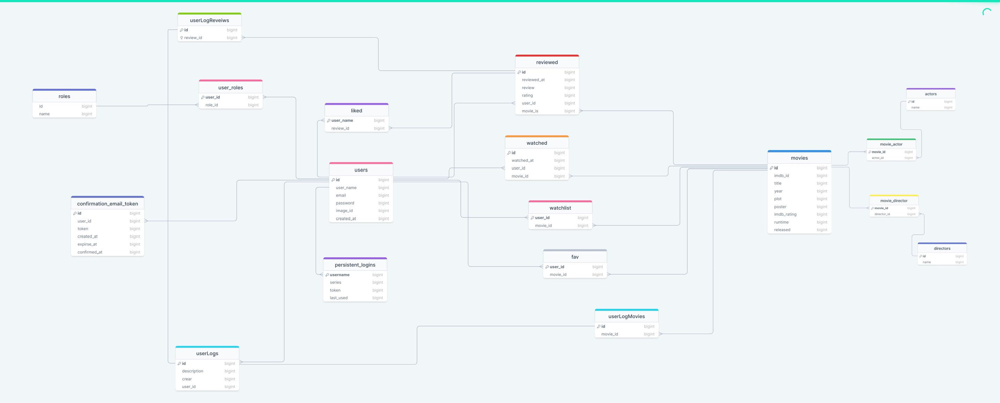
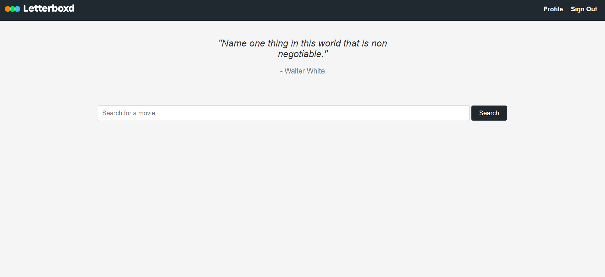

# LetterBoxdX (in Spring)

## Description

The application allow to add movies , rate them, write reviews and like reviews of other users. It is a clone of [Letterboxd](https://letterboxd.com/) website.

two types of users:
* **user** - can add movies to his/her watchlist, rate them, write reviews and like reviews of other users.
* **guest** - can see the movies, profiles of users, reviews and ratings.

## Tools & Frameworks

The application is written using Spring MVC framework and Maven (for external dependency managment).

**Database & configuration**
* MySQL
* Tomcat
* Git
* Quote Movies API
* Movie API

**Backend technologies**
* Java
* Spring MVC, Spring AOP, Spring Security
* Hibernate ORM, Hibernate Validator
* JSON
* Project Lombok

**Frontend technologies** (with chatGPT)
* HTML, CSS, JavaScript
* JSP

## How to run it?

1. Clone this git repository

` $ git clone https://github.com/Shehapp/LetterBoxdX.git`

2. Go to a folder `src/main/resources/properties`, add your Movie API key ([here are instructions how to obtain it](https://collectapi.com/api/imdb/imdb-api)) as follows:

` movie.apiKey=[YOUR KEY HERE] `

3. Go to a folder `src/main/resources/properties`, add your db.properties file as follows:

`  db.driver=com.mysql.jdbc.Driver `

  ` db.url=jdbc:mysql://localhost:3306/[YOUR SCHEMA NAME HERE]?useSSL=false&serverTimezone=UTC`
  
   `db.username=[YOUR USERNAME HERE]`
   
   `db.password=[YOUR PASSWORD HERE]`

4. The application will available under URL `http://localhost:8080/home`

## Database Diagram

Big picture on the database relationships.

## Screenshots

Login page

Sign up page

Main page, after login. The quote is taken from [Random Quote API](https://api.breakingbadquotes.xyz/v1/quotes/1).

searching for movies

movie details

reviews of a movie

profile page

review in profile page

activity page

